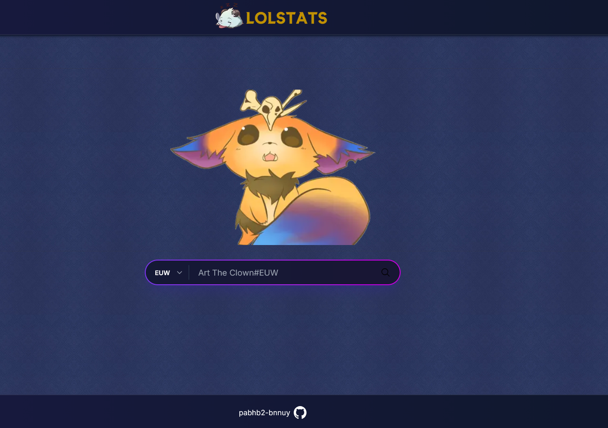
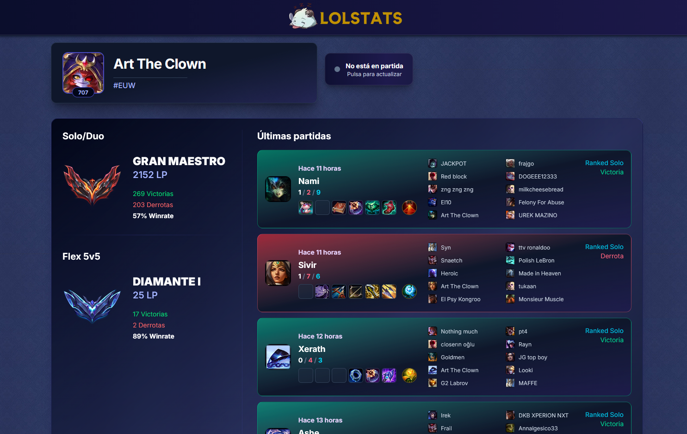
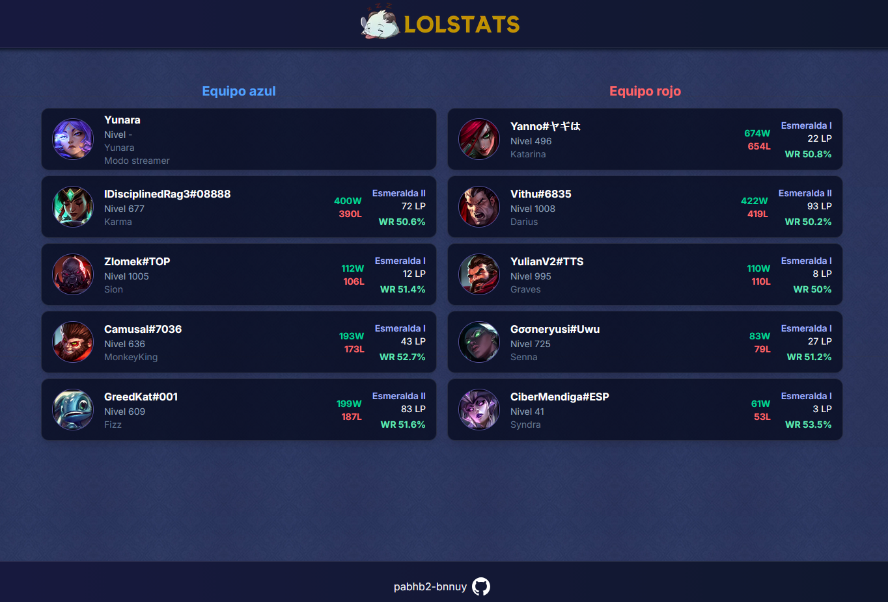

# LOLSTATS


Web/App desarrollada con **Next.js** para la consulta de estadísticas de jugadores de **League of Legends**, visualización de su historial, partidas, comprobar si el jugador esta jugando en ese momento y poder consultar las estadísticas de los jugadores en dicha partida en vivo. Todo usando la API oficial de Riot Games.

---

# Capturas

### Página principal



---

### Perfil de invocador



---

### Partida en vivo



---

# Características

- Búsqueda de jugadores mediante Riot ID.
- Historial de partidas recientes.
- Estadísticas de SoloQ y Flex.
- Información detallada de cada partida.
- Detección de partidas en directo.
- Visualización de ambos equipos en una partida activa.
- Información de rango, LP, nivel y winrate.
- Interfaz responsive.
- Preparado para despliegue mediante Docker.

---

# Estructura del proyecto (para desplegarlo)

```text
.
release/
├── .env.example
├── docker-compose.yml
├── Dockerfile
└── nginx.conf
```

El directorio `release/` contiene todo lo necesario para lanzar la web/app mediante Docker.

---

# Configuración

Entrar en el directorio release:

```bash
cd release
```

Editamos el fichero `.env` para meter tu clave de la API de Riot:

```env
RIOT_API_KEY=TU_API_KEY
```

---

# Despliegue

Desde el directorio `release`:

```bash
docker compose up --build -d
```

Una vez finalice la compilación, la aplicación estará disponible en:

```text
http://localhost
```

Nginx actúa como proxy inverso hacia la aplicación Next.js.

---

## Autor

[](https://github.com/pabhb2-bnnuy)
